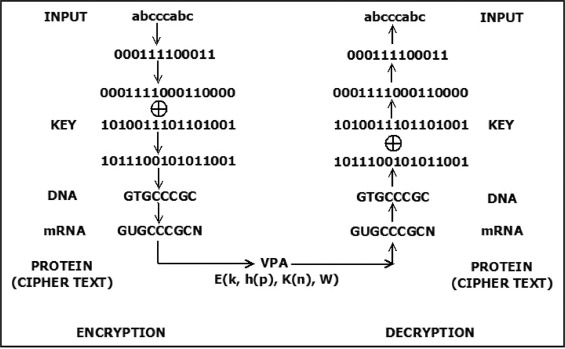
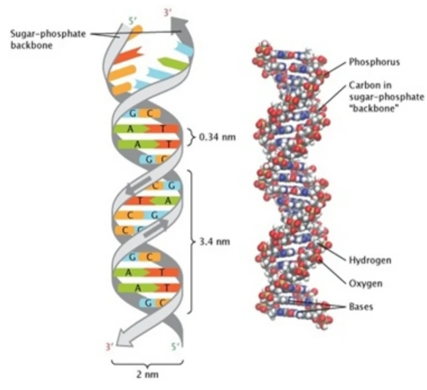
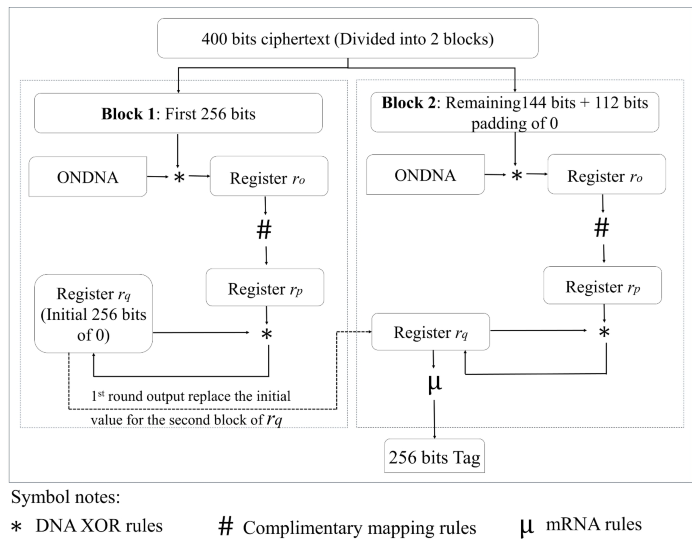
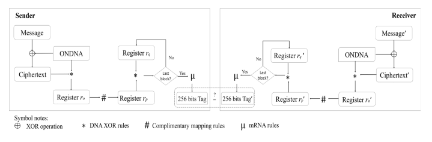
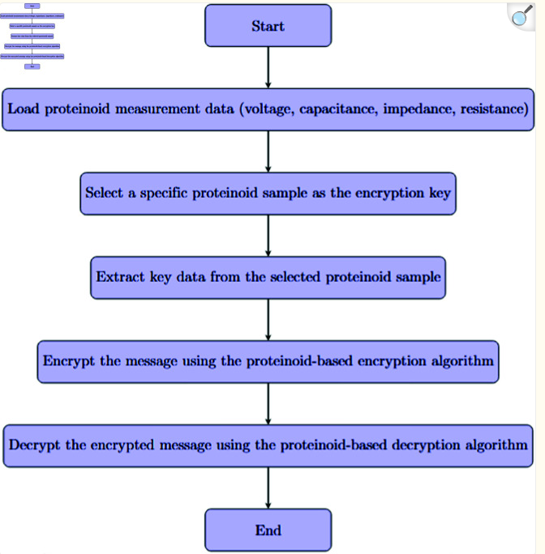
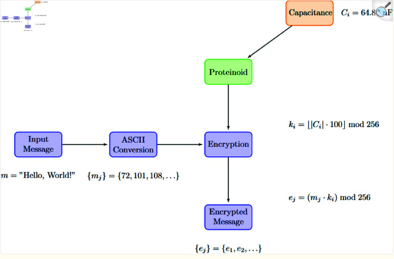

## Introduction

Bio-inspired cryptography asks a different question from ordinary cryptography. Instead of only asking how to scramble bits with abstract mathematics, it asks whether biological rules, biological molecules, or biological measurements can become part of a secure system. In that sense, biology can matter in two different ways: it can provide the **model** for an algorithm, or it can provide the **physical source** of key material.

## Basics of Cryptography: A Story of Alice and Bob

At the broadest level, cryptography is the science of protecting information from unauthorized access while still allowing the intended receiver to recover it. Symmetric cryptography uses the same secret key for encryption and decryption, while asymmetric cryptography uses linked public and private keys.

The standard teaching story uses Alice and Bob:

1. Bob wants to send Alice a private message.
2. Bob and Alice each generate a public key and a private key.
3. Bob encrypts his message with Alice's public key, and only Alice's private key can decrypt it.
4. Alice can do the same in reverse with Bob's public key.

That basic story explains confidentiality, but it does not fully solve authenticity. Alice also wants to know that the message really came from Bob and was not changed in transit. That is where **message authentication** becomes important, and that is the main problem the ODNAMAC paper tries to solve.

## ODNAMAC and DNA-Inspired Authentication

In *Omega deoxyribonucleic acid cryptography key-based authentication* (Scientific Reports, published November 27, 2025), Chai Wen Chuah, Jocelyn Tey, and Kamaruddin Malik Mohamad propose **ODNAMAC**, a DNA-inspired message authentication design meant for resource-constrained systems such as IoT devices, embedded devices, and mobile applications.

The overall design is **encrypt-then-authenticate**:

1. The sender encrypts the message with the ONDNA process.
2. The sender generates a fixed 256-bit authentication tag from the ciphertext.
3. The receiver recomputes the tag and checks it **before** decrypting.

That third step matters because it saves computation. If the tag fails, the receiver can stop immediately instead of wasting time decrypting altered data.

### How the ODNAMAC Algorithm Works

The paper says ODNAMAC has three parts: `Gen`, `Tag`, and `Ver`.

- `Gen` creates a 256-bit pseudorandom DNA-based secret key using ONDNA.
- `Tag` transforms ciphertext blocks with DNA XOR rules, complementary base mapping, and mRNA mapping rules.
- `Ver` recomputes the tag on the receiver side and checks whether the received tag matches.

The paper's worked example uses a 400-bit ciphertext. It is split into a 256-bit block and a 144-bit block, and the shorter block is padded with 112 zero bits so both blocks fit the same size. The process can be summarized as:

$$
R_0 = 0^{256}
$$

$$
X_i = C_i \oplus_{\mathrm{DNA}} K
$$

$$
Y_i = \operatorname{Comp}(X_i)
$$

$$
R_i = R_{i-1} \oplus_{\mathrm{DNA}} Y_i
$$

$$
T = \operatorname{mRNA}(R_n)
$$

Here, $C_i$ is the $i$th ciphertext block, $K$ is the 256-bit ONDNA key, $\operatorname{Comp}$ is complementary base mapping, and $T$ is the final 256-bit authentication tag. This notation is a compact restatement of the paper's flowchart and 400-bit example, not a new algorithm of my own.

What makes this scheme "DNA-inspired" is that its internal operations imitate biological information processing:

- **DNA XOR rules** treat DNA symbols as a symbolic alphabet for combining data and key material.
- **Complementary mapping** imitates the base-pairing logic of nucleotides.
- **mRNA mapping rules** imitate a DNA-to-RNA style transformation to produce the final tag.

This is still digital software cryptography, not wet-lab DNA computing. The biology is in the **encoding rules and information model**, not in a literal strand of DNA sitting inside the device.

### Why ODNAMAC Is Interesting

The paper gives several reasons the scheme is worth taking seriously.

- It always produces a **fixed 256-bit tag**, even for shorter messages.
- It is designed for **low computational complexity**, which matters for devices with limited power and memory.
- The authors report that concatenated tags passed the **Dieharder** statistical testing suite, with reported p-values of `0.23583` for one-character-varied messages and `0.11187` for a non-random-message test set.
- The paper also gives a formal argument that, **if** ONDNA behaves like an ideal pseudorandom function, then ODNAMAC is secure against existential forgery under a chosen-message attack.

The paper's small-change examples are especially useful. One message differs from another by only a period, yet the produced tags are completely different. That is exactly what a good authentication system should do: a tiny change in the input should produce a drastically different output.

## Proteinoid Assemblies as Key Material

The second paper, *Bio-inspired cryptography based on proteinoid assemblies* (PLOS One, published May 28, 2025), by Panagiotis Mougkogiannis, Essam Ghadafi, and Andrew Adamatzky, takes a very different approach. Instead of using biology as a symbolic language, it tries to use **biological-like material itself** as the source of cryptographic keys.

Proteinoids are thermally formed protein-like polymers made from amino acids. In the paper, the researchers synthesize proteinoid microspheres, measure their electrical properties, and then turn those measurements into keys. The key idea is that different proteinoid compositions produce different capacitance, resistance, and impedance values, so the material itself becomes part of the security system.

The paper states that amino acids were thermally polymerized at $180 \pm 1^\circ\mathrm{C}$ and that electrical properties were measured with an LCR meter at `300 kHz`. Reported capacitance values ranged from `-656.6 nF` to `434.9 nF`, depending on composition.

The key derivation equation given in the paper is:

$$
k_i = \left(\left\lfloor |C_i| \cdot 100 \right\rfloor \bmod 256\right)
$$

where $C_i$ is the measured capacitance of a proteinoid sample and $k_i$ is the derived byte-sized key value.

Encryption is then described as:

$$
e_j = (m_j \cdot k_i) \bmod 256
$$

where $m_j$ is the $j$th plaintext ASCII value and $e_j$ is the encrypted output byte.

### What the Proteinoid Scheme Is Actually Doing

The pipeline is:

1. Synthesize a proteinoid composition from amino acids.
2. Measure its electrical properties, especially capacitance.
3. Convert the measurement into a digital key with modular arithmetic.
4. Use that key to transform plaintext bytes.

That is a radical departure from normal software cryptography. The secret is no longer just a number typed into a machine. It is partially tied to a **material sample**, the exact conditions under which it was made, and the exact conditions under which it was measured.

The paper also argues that this system can be strengthened by:

- combining multiple proteinoid-derived values into a composite key
- using resistance and impedance alongside capacitance
- deriving time-varying keys from changing measurements
- using calibration and synchronization protocols between sender and receiver

The authors report a **key reproduction reliability of 98.7%**, which is important because both sides have to reproduce matching key material if the system is going to work at all.

## AP Biology Framework Connections

1. **SLO 6.5.A / LT 6.5.A.1**: regulator sequences are stretches of DNA that interact with proteins to control transcription. ODNAMAC depends on the idea that nucleotide sequences can carry rule-governed information, so this target helps explain why DNA can be treated as an information alphabet rather than just as a molecule.
2. **SLO 6.6.A / LT 6.6.A.1**: RNA polymerase and transcription factors bind promoter or enhancer DNA sequences to initiate transcription. ODNAMAC's mRNA mapping step is a computational analogy to DNA-to-RNA information transfer, which makes this learning target directly relevant to the paper's design language.
3. **SLO 6.6.B / LT 6.6.B.1**: gene regulation leads to differential gene expression and changes in cell products and functions. ODNAMAC shows the same logic at an abstract level: small changes in the input produce sharply different outputs, so information control changes the final product.
4. **SLO 6.8.A / LT 6.8.A.1**: genetic engineering techniques can analyze and manipulate DNA and RNA, and DNA sequencing determines nucleotide order. DNA cryptography relies on the same core idea that nucleotide order can be encoded, read, manipulated, and compared as information.
5. **SLO 3.1.A / LT 3.1.A.1**: the structure and function of proteins contribute to the regulation of biological processes. The proteinoid paper depends on structure-function relationships because different amino acid combinations create different measurable electrical behaviors.
6. **SLO 3.2.A / LT 3.2.A.1**: a change to molecular structure may change function or efficiency. That idea is central to the proteinoid paper: changing composition changes capacitance, and changing capacitance changes the derived key and the resulting ciphertext.

## Limitations and Scientific Caution

The most important weakness of both papers is that "bio-inspired" does **not** automatically mean "more secure."

For ODNAMAC, the biggest caution is that statistical randomness is not the same thing as broad cryptographic trust. Passing a Dieharder test is useful, but it does not replace decades of cryptanalysis in the way that established MAC constructions such as HMAC have been studied. The paper's proof also depends on the assumption that ONDNA behaves as an ideal pseudorandom function, so the security claim is only as strong as that assumption.

For the proteinoid paper, the security issues are even sharper. The paper itself later notes that its current modular-multiplication design can leave patterns in the ciphertext and may not provide enough diffusion. The authors explicitly suggest future improvements such as extra encryption rounds, S-box transformations, stronger key scheduling using both capacitance and impedance, and padding schemes. That is a strong sign that the current scheme is promising but still experimental.

The main issue which is posed when developing bio-inspired cryptography algorithms is to make sure that the algorithms are resisant to brute force. No matter how secure an algorithm may seem, it must be able to resist brute force which means multiple checks must go right in the system to make it work.

## Conclusion

These two papers represent two distinct branches of bio-inspired cryptography. ODNAMAC treats biology as an information model and uses DNA-style symbolic transformations to produce authentication tags. The proteinoid paper treats biology-like material as part of the key-generation process and tries to turn measurable electrical behavior into secret values.

Neither paper has replaced standard cryptography, and both still have limitations. Even so, they show that biological ideas can influence cryptographic design in serious and technically interesting ways. That makes bio-inspired cryptography more than a novelty topic. It is a real research direction at the boundary of biology, computation, and security engineering. In a world where quantum computers are rising and are making large scale attacks more feasible, more niche means of developing cryptographic algorithms must be explored.

## Works Cited

- Chuah, Chai Wen, Jocelyn Tey, and Kamaruddin Malik Mohamad. ["Omega deoxyribonucleic acid cryptography key-based authentication"](https://www.nature.com/articles/s41598-025-29168-y). *Scientific Reports*, vol. 15, article 45473, November 27, 2025.
- Mougkogiannis, Panagiotis, Essam Ghadafi, and Andrew Adamatzky. ["Bio-inspired cryptography based on proteinoid assemblies"](https://pmc.ncbi.nlm.nih.gov/articles/PMC12118996/). *PLOS One*, May 28, 2025.
